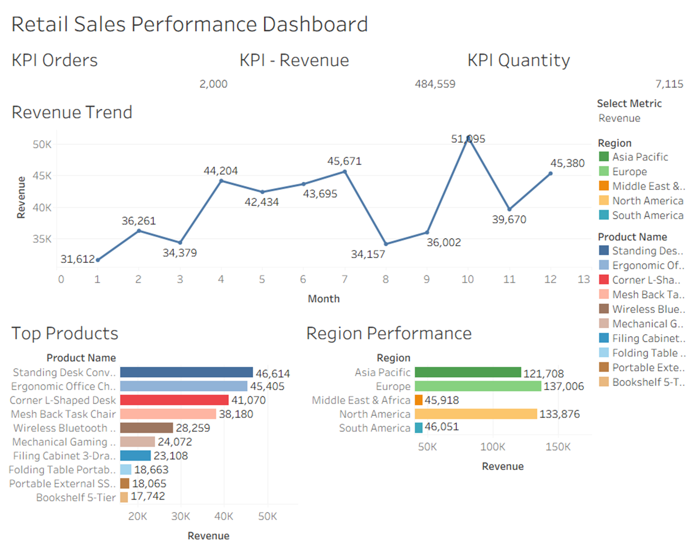

# Retail Data Pipeline & Analytics Dashboard

## 📌 Project Overview
This project demonstrates an end-to-end data pipeline that processes raw retail data into a structured data model and visualizes insights using Tableau.

---

## 🏗️ Architecture
Raw Data → Cleaning → Validation → Transformation → SQLite Database → Tableau Dashboard

---

## ⚙️ Tech Stack
- Python (Pandas)
- SQL (SQLite)
- Tableau
- Logging & Scheduling (Python)

---

## 🔄 ETL Pipeline
- Extracted raw retail data from CSV
- Cleaned and handled missing/invalid records
- Validated data for consistency and quality
- Transformed data into a star schema (Fact + Dimensions)
- Loaded data into SQLite database

---

## 🧩 Data Model
- Fact Table: Sales transactions
- Dimension Tables:
  - Customer
  - Product
  - Date

---

## 📊 Dashboard Features
- KPI metrics (Revenue, Orders, Quantity)
- Trend analysis over time
- Region-wise performance
- Dynamic metric selection using parameters
- Top N product analysis

---

## 🚀 How to Run

```bash
pip install -r requirements.txt
python scripts/etl_pipeline.py --run
```

---

## 📊 Dashboard Preview
